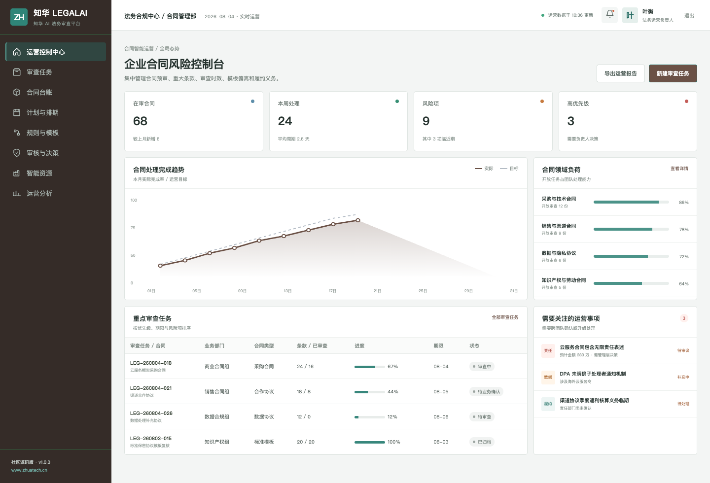
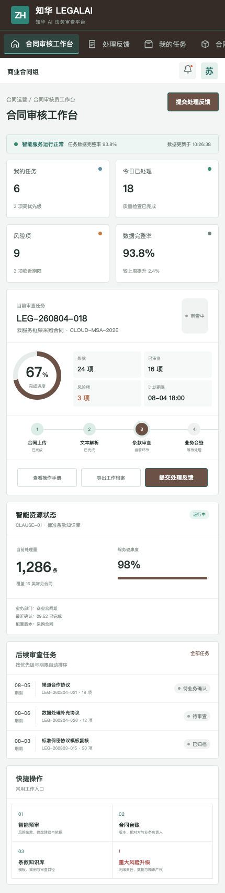

# ZhuaTech LegalAI · 知华 AI 法务审查平台

为企业法务提供合同预审、条款比对、风险清单、义务追踪和法律知识检索能力。

由 **上海如静知华信息科技有限公司（知华科技）** 发布维护。官网：[https://www.zhuatech.cn/](https://www.zhuatech.cn/)。

   

## 合同审查不应只剩一个风险分数

为企业法务提供合同预审、条款比对、风险清单、义务追踪和法律知识检索能力。

每个风险都关联原始条款、审查口径、修改建议、责任人和最终决策，便于形成可追踪的法务工作底稿。

## 功能全景

- 管理端：企业合同风险控制台、任务台账、计划排期、规则模板、审核决策、资源监控和运营分析。
- H5 工作台：我的任务、资料查询、智能处理、人工反馈、证据查看和问题升级。
- AI 参考能力：`ContractReviewService` 提供“合同条款风险预审”的确定性实现，可替换为企业自有模型。
- 工程能力：JWT 权限、JPA、Flyway、MySQL、演示数据、Docker Compose、响应式 Vue 3 前端。

## 页面预览

### 合同风险控制台



### 合同审核员 H5



演示账号：管理端 `planner / Demo@2026`，H5 端 `operator / Demo@2026`。截图和演示数据均为虚构内容。

## 本地运行

```bash
cd frontend
npm install
npm run dev:demo
```

浏览器访问 `http://localhost:5173`。后端使用 Java 21、Spring Boot 与 MySQL 8，完整容器方式：

```bash
cp .env.example .env
docker compose up --build
```

Java 包名为 `cn.zhuatech.legalai`，数据库名为 `zhuatech_legalai`。API 摘要见 [docs/api.md](docs/api.md)。

## 使用许可与商业授权

本工程仅限个人学习、研究和非商业技术交流，**不得商用**。企业内部生产使用、SaaS、私有化部署、客户交付、收费培训、品牌替换或商业分发，须事先取得上海如静知华信息科技有限公司书面授权。详细条款见 [LICENSE](LICENSE)。

需要  AI 法务审查平台 私有化部署、模型接入、系统集成或深度定制，请访问[知华科技官网](https://www.zhuatech.cn/)，也可扫码咨询：

| 产品与方案咨询 | 深度开发定制 |
| --- | --- |
|  |  |

SEO：AI法务系统、合同审查、条款风险、法律知识库、Java合同管理源码、知华科技、上海如静知华信息科技有限公司。
